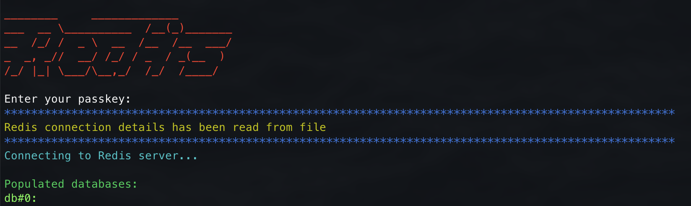

# Redis CLI with Secure Credentials Storage

A Python-based easy to use command-line interface for interacting with Redis databases.
It provides interactive way to navigate Redis DBs and view/manipulate particular keys. 

## Installation

Before running the script, you'll need to have Python 3 installed on your machine. Once you have Python, you can install the necessary packages with the following commands:

```sh
pip3 install redis
pip3 install termcolor
pip3 install chardet
pip3 install pycryptodome
```

You might need to use sudo before each command if you're on a Unix-based system and you encounter permission issues.

## Configuration

When run for the first time, the script will prompt you to enter your Redis server details: hostname, port, password, and whether to use TLS. These credentials will be stored in a file named `.rediscli` in the same directory, encrypted using AES_256_CBC_SHA256.

Whenever you run the script afterwards, it will attempt to read the credentials from the `.rediscli` file. You'll be prompted to enter the passkey you used to encrypt the file.

## Usage



After connecting to the Redis server, the script will list all populated databases and prompt you to select one. After selecting a database, it will list all keys in the database and prompt you to select a key.

You'll then be given options to perform various operations on the selected key:

* (G)et the value
* (S)et the value
* (D)elete the key
* (T)TL: Get the time-to-live
* (Y)pe: Get the type of value
* (Q)uit

## Security

Credentials are stored using AES-256-CBC encryption with SHA256 key derivation.

The script also supports connecting to Redis servers via TLS, which ensures that all data sent between the script and the server is encrypted.


## ToDo

1. Add support for direct connection strings for common cloud providers;
2. Add support for storing several connections in `.rediscli`;
3. Add possibility to switch DBs/keys on the fly;
4. Add test coverage;
5. Add setup.py with more automated way of running the script;
6. Refactor;
